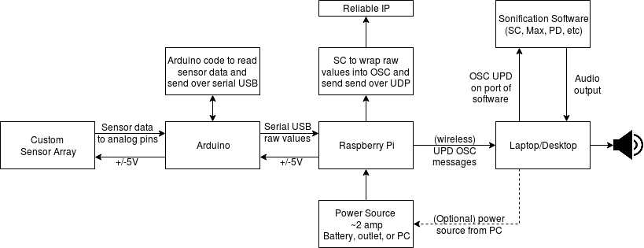

# OMI-Pod
Code for the Yale OMI Pod workshop on 9/17/17

TODO 

- add picture of actual device
- connect sensors to pi sender

## The Pod

the pod directory has the code that goes on the Arduino. Edit this with the Arduino IDE

### Required Libraries

- SFE_MMA8452Q (https://learn.sparkfun.com/tutorials/mma8452q-accelerometer-breakout-hookup-guide/example-code)
- CmdMessenger (https://playground.arduino.cc/Code/CmdMessenger)

## The Mothership

The Mothership directory has the code that processes the messages recieved from the pod.
Examples are given in both SuperCollider and PureData.
