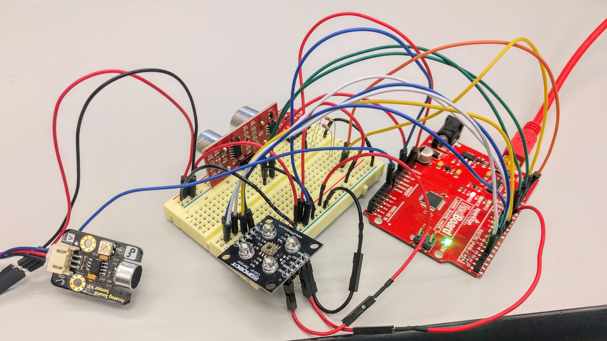

# OMI-Pod
Code for the Yale OMI Pod workshop on 9/21/17

[Event Page](https://www.facebook.com/events/1058338124303703/)

TODO 

- add picture of actual device
- connect sensors to pi sender

## The Pod

The Pod directory has the code that goes on the Arduino. Edit this with the Arduino IDE.

omipod-pi.scd should run on the pod to send the sensor from the arduino to any connected clients

omiclient-pi.scd should run on some PC to process the sensor data coming in over the internet.

### Required Libraries

- SFE_MMA8452Q (https://learn.sparkfun.com/tutorials/mma8452q-accelerometer-breakout-hookup-guide/example-code)
- CmdMessenger (https://playground.arduino.cc/Code/CmdMessenger)

